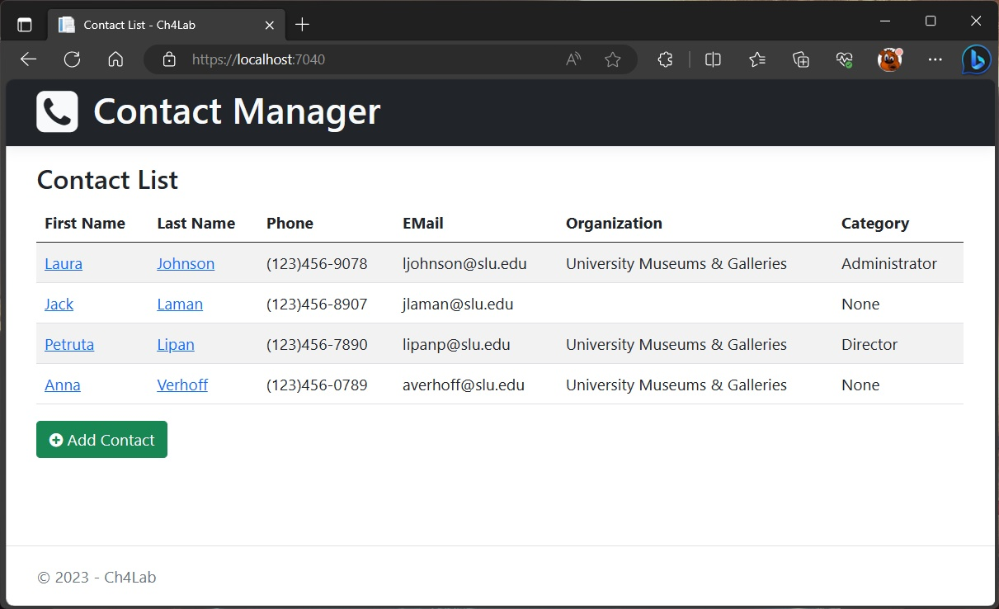
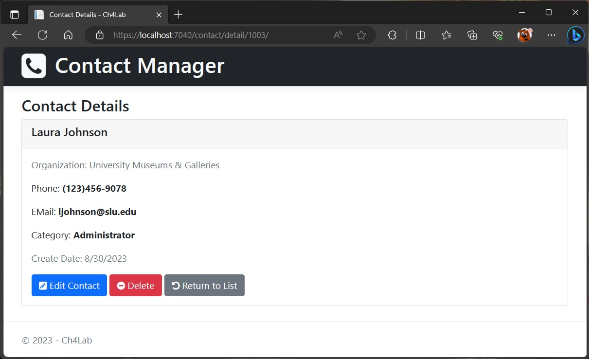
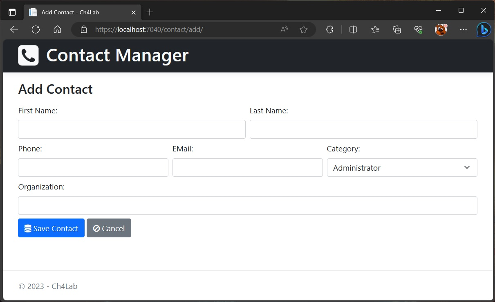
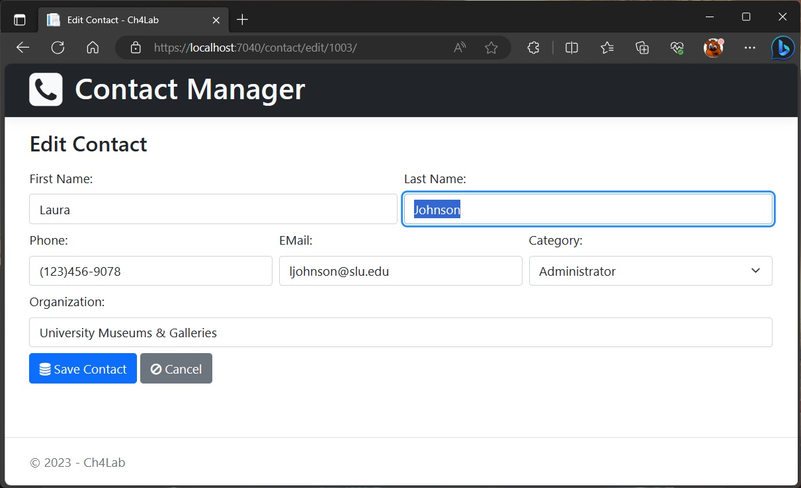
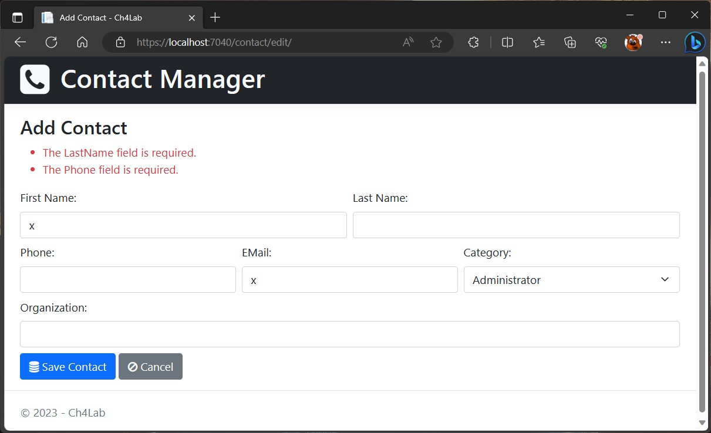
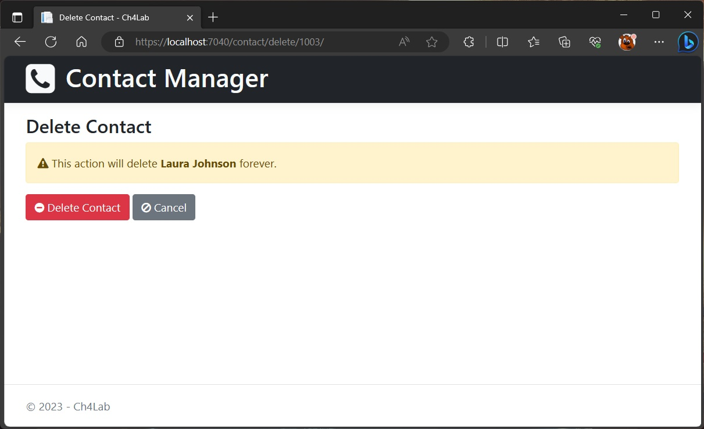

# Build the Contact Manager app
For this project, you will build a multi-page, data-driven app like the one shown below.

### The List Page

### The Details Page

### The Add/Edit Page (both are in the same view)

### The Delete Page

### Specifications
- When the app starts, it should display a list of contacts and a button to add a contact.
- If the user clicks the first or last name of the contact, the app should display the **Detail** page for that contact.
- The Detail page should include buttons that allow the user to edit or delete the contact.  Before deleting a contact, the app should display the **Delete** page to confirm the deletion.
- To reduce code duplication, the **Add/Edit** page should both use the same view.  This view should include a drop-down for **Category** values.
- The Add/Edit Page should not include the **Create Date** field that's displayed by the Details page.  That field is not editable and is only set when the contact is created.
- If the user enters invalid data on the Add/Edit page, the app should display a summary of validation errors above the form.
- Here are the requirements for valid data
    - The FirstName, LastName, Phone, and EMail are required.
    - The Organization field is optional.
- If the user clicks the Cancel button on the **Add** page, the app should display the **Home** page.
- If the user clicks the Cancel button on the **Edit** page, the app should display the **Details** page for that contact.
- The domain model class for the **Contacts** should use primary key that is generated by the database.  The domain model class for the **Category** should use hard coded primay key.
- The **Contact** class should have a foreign key field that relates it to the Category class.
• Use EF Code First to create a database based on your domain model classes. Include seed data for the categories and one or more contacts.
• Use a Razor layout to store the **`<html>`**, **`<head>`**, and **`<body>`** elements.
• Use Bootstrap to style the views. If necessary, use a custom CSS style section to override Bootstrap classes.
• Make the app URLs lowercase with trailing slashes.

### References
- [Font Awesome](https://fontawesome.com/v4/icons/) *used Version 4 because its easier to start with.*
- [Bootstrap](https://getbootstrap.com/docs/5.2/getting-started/introduction/)
- [EF Core Model](https://learn.microsoft.com/en-us/ef/core/modeling/)
- [EF Core One-to-Many](https://learn.microsoft.com/en-us/ef/core/modeling/relationships/one-to-many)